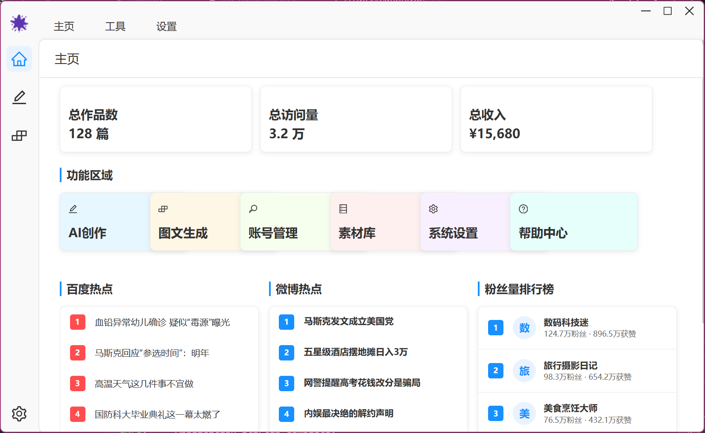

# inkflow
一个基于 Electron + Vue3 的 AI 内容创作与自动发布系统，支持文章生成、编辑与多平台投放自动化，拥有美观的吸血鬼暗色主题桌面端体验。

## 项目概述
inkflow 致力于通过 AI 技术提升内容创作效率，实现从文章生成到多平台发布的全流程自动化。系统集成多种 AI 模型，支持自定义模板与发布规则，适用于多场景内容创作。

## 效果预览


## 核心功能
- **AI 内容生成**：集成 Ollama、DeepSeek、SiliconFlow、阿里云百炼等多平台 AI 模型
- **桌面端体验**：Electron 打包，支持 Windows/macOS/Linux，原生窗口自定义、吸血鬼暗色主题
- **可视化编辑**：富文本编辑器，支持内容格式化与多媒体插入
- **多平台发布**：一键发布至主流内容平台（需配置 API 密钥）
- **模板系统**：自定义文章模板，统一内容风格与格式
- **任务调度**：定时发布与批量操作，提升运营效率

## 技术栈
- **桌面端**：Electron、Vue 3、TypeScript、Vite、Pinia、Vue Router、Ant Design Vue
- **后端**：Python、FastAPI、LangChain
- **AI 集成**：Ollama API、DeepSeek API、SiliconFlow API、阿里云百炼 API
- **数据库**：（规划中）
- **部署**：Docker（规划中）

## 目录结构
```
inkflow/
├── ink-backend/            # Python 后端服务
│   ├── src/                # FastAPI 应用与服务实现
│   ├── requirements.txt    # 后端依赖
│   └── ...
├── ink-electron-vue/       # Electron+Vue3 桌面端
│   ├── src/                # 前端源码（renderer、主进程、预加载等）
│   ├── package.json        # 前端依赖
│   └── ...
├── start-backend.js        # 后端启动脚本
├── start-frontend.js       # 前端启动脚本
└── README.md
```

## 快速开始
### 环境要求
- Node.js 16+
- Python 3.8+ & pip
- (推荐) 已配置好系统环境变量的 Chrome 浏览器

### 安装与启动

#### 方式一：一键启动 (Windows - 推荐)
本项目提供了一个便捷的一键启动脚本 `start.bat`，它会自动完成所有环境配置、依赖安装和服务启动的步骤。

1.  **克隆仓库**
    ```bash
    git clone https://github.com/yourusername/inkflow.git
    cd inkflow
    ```

2.  **运行启动脚本**
    直接双击项目根目录下的 `start.bat` 文件。

    脚本将自动执行以下操作：
    - 安装 Python 后端依赖 (`requirements.txt`)。
    - 安装 Node.js 前端依赖 (`package.json`)。
    - 在新窗口中分别启动后端和前端服务。

#### 方式二：手动分步启动

**1. 克隆仓库**
```bash
git clone https://github.com/yourusername/inkflow.git
cd inkflow
```

**2. 安装后端依赖**
```bash
cd ink-backend
pip install -r requirements.txt
cd ..
```

**3. 安装前端依赖**
```bash
cd ink-electron-vue
npm install
cd ..
```

**4. 启动服务**
你需要打开两个终端窗口：

- **终端 1: 启动后端**
  ```bash
  node start-backend.js
  ```
- **终端 2: 启动前端**
  ```bash
  node start-frontend.js
  ```

### 配置 AI 服务
修改 `ink-backend/src/config/ai_services.json` 配置文件，添加或调整 AI 服务提供商：
```json
{
  "services": [
    {
      "name": "ollama",
      "type": "ollama",
      "base_url": "https://ollama.campus.lk233.link/api",
      "models": ["deepseek-r1:14b", "huihui_ai/gemma3-abliterated:latest"],
      "api_key_required": false
    }
    // 其他 AI 服务配置...
  ]
}
```
> **注意**: 配置文件路径可能为 `ink-backend/config.json` 或 `ink-backend/src/config/ai_services.json`，请根据实际情况调整。

## 测试
运行后端单元测试：
```bash
cd ink-backend
pytest tests/test_api.py
```

## 特色亮点
- **吸血鬼暗色主题**，更具美感与层次感
- **自定义窗口栏与原生按钮**，桌面端体验极佳
- **AI 内容生成与多平台自动发布**
- **支持浏览器和桌面端双模式访问**（桌面端有更多原生特性）

## 后续规划 (Roadmap)
- **Phase 1: 核心功能完善与产品化**
  - [x] **软件打包与分发**: 完成前后端一体化打包，生成独立的桌面安装程序（`.exe`, `.dmg`），确保在主流操作系统上能开箱即用。
  - [ ] **模型 API 管理**:
    - [ ] 在后端，启动时检查 `config.json` 等配置文件，如果必要的模型 API 密钥缺失，则以日志或错误提示方式明确告知用户，引导其进行配置，避免运行时错误。
    - [ ] 在前端，增加一个独立的"模型服务管理"界面，允许用户动态、安全地添加、修改、删除和测试不同的 AI 服务提供商及其 API 密钥。

- **Phase 2: 知识库集成与智能化**
  - [ ] **知识库后端集成**:
    - [ ] 设计并实现知识库连接模块，支持多种数据源（如本地 Markdown 文件、Notion、网页等）。
    - [ ] 构建向量化与检索流程（RAG），将知识库内容转化为 AI 可理解的格式。
  - [ ] **知识库前端集成**:
    - [ ] 在 AI 创作界面，增加知识库选择器，允许用户在提问时挂载一个或多个知识库。
  - [ ] **智能化图文生成**:
    - [ ] 优化图文生成逻辑，使其能够利用所选知识库的内容进行回答和创作，生成更具个性化和深度的内容。

- **Phase 3: 用户体验与管理优化**
  - [ ] **知识库管理界面**:
    - [ ] 开发一个独立的前端界面，用于管理所有知识库。用户可以上传文件、输入网址、查看同步状态、手动更新或删除知识库。

## 许可证
[MIT](LICENSE)
